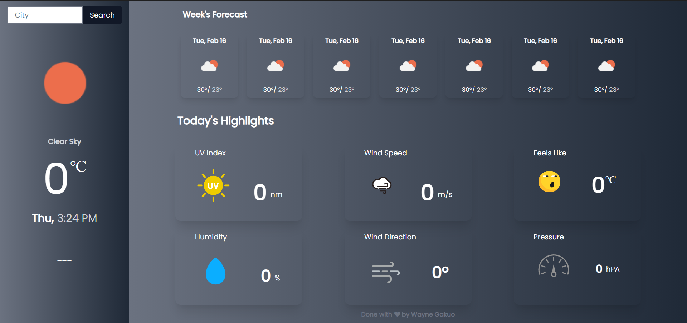
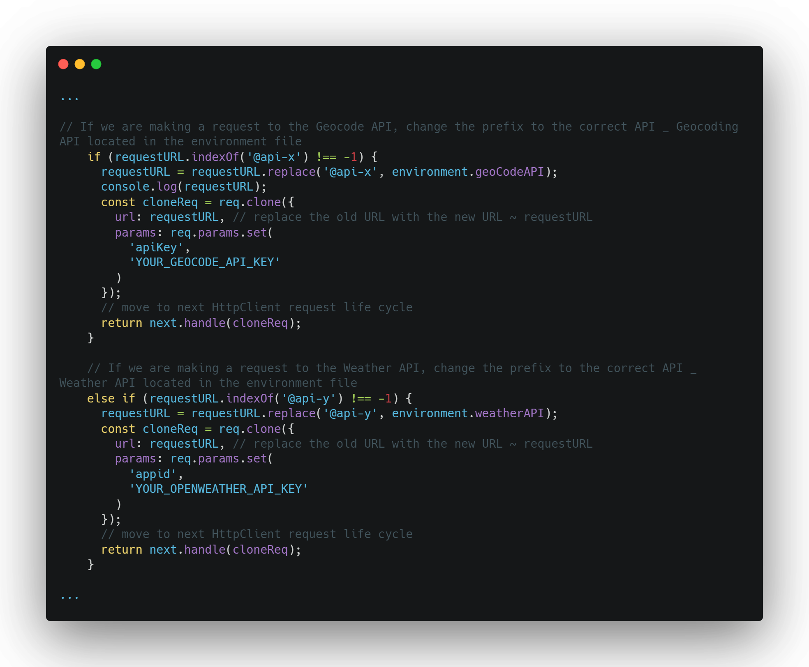

# Weather Forecast

This project was generated with [Angular CLI](https://github.com/angular/angular-cli) version 11.1.0.

The Weather Forecast App uses the [OpenWeather API](https://openweathermap.org/) to provide a city's current weather forecast & a 7-Day weather forecast. The app also uses [Here API](https://www.here.com/) to provide geo-coordinates of a known address, place, locality or administrative area, even if the query is incomplete or partly incorrect.

_It is very important to have an OpenWeather & HERE Geocoding AP Keys_

- [OpenWeather API Documentation](https://openweathermap.org/api/one-call-api)
- [Here API Geocoding Documentation](https://developer.here.com/documentation/geocoding-search-api/dev_guide/topics/endpoint-geocode-brief.html)

## API Keys

Inside the `api.interceptor.ts` in the `Interceptors` folder (`src > app > interceptors`), replace the `YOUR_GEOCODE_API_KEY` & `YOUR_OPENWEATHER_API_KEY` sections with their respective API keys which you would have generated.

## Progressive Web App (PWA)

This web app is PWA-enabled; you can install it on your phone if you wish to do so. Read more about PWA at [PWAFire](https://pwafire.org/)

## Development server

Run `ng serve` for a dev server. Navigate to `http://localhost:4200/`. The app will automatically reload if you change any of the source files.

## Code scaffolding

Run `ng generate component component-name` to generate a new component. You can also use `ng generate directive|pipe|service|class|guard|interface|enum|module`.

## Build

Run `ng build` to build the project. The build artifacts will be stored in the `dist/` directory. Use the `--prod` flag for a production build.

## Running unit tests

Run `ng test` to execute the unit tests via [Karma](https://karma-runner.github.io).

## Running end-to-end tests

Run `ng e2e` to execute the end-to-end tests via [Protractor](http://www.protractortest.org/).

## Further help

To get more help on the Angular CLI use `ng help` or go check out the [Angular CLI Overview and Command Reference](https://angular.io/cli) page.
# weather-forecast
